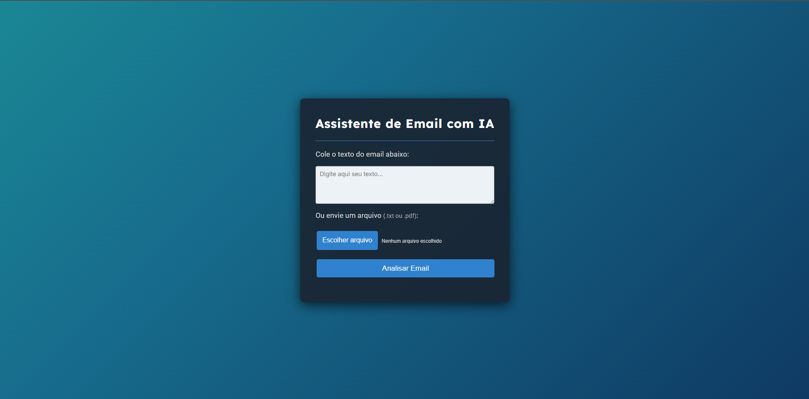
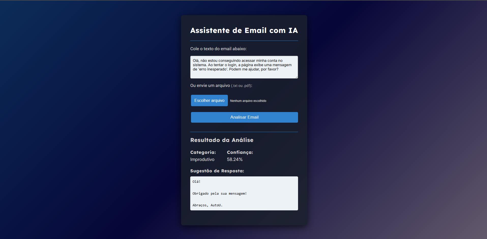

# Assistente de Email com IA

Um sistema web inteligente para análise e sugestão de respostas automáticas para emails, utilizando Python, Flask e modelos de IA da Hugging Face.

---

## Sobre o Projeto

O **Assistente de Email com IA** é uma aplicação web que permite ao usuário colar o texto de um email ou enviar um arquivo `.txt` ou `.pdf`. O sistema utiliza inteligência artificial para classificar o email como **Produtivo** ou **Improdutivo** e sugere uma resposta automática personalizada.

Principais características:

- **Classificação Inteligente:** Utiliza o modelo zero-shot da Hugging Face para identificar a categoria do email.
- **Sugestão de Resposta:** Gera automaticamente uma resposta adequada conforme a categoria.
- **Upload de Arquivos:** Aceita arquivos `.txt` e `.pdf` para análise.
- **Interface Responsiva:** Desenvolvida com HTML5, CSS3 e JavaScript.
- **Backend em Python:** Utiliza Flask para servir a aplicação e processar as requisições.
- **Deploy com Docker e Gunicorn:** Pronto para rodar em containers e ambientes de produção.
- **Deploy público:** Disponível em [https://thiago-ribeiro-21-assistente-email-com-ia.hf.space/](https://thiago-ribeiro-21-assistente-email-com-ia.hf.space/)

---

## Etiquetas

[](./LICENSE)


<br>


---

## ✨ Deploy Online

Acesse a versão pública do projeto:  
🔗 [https://thiago-ribeiro-21-assistente-email-com-ia.hf.space/](https://thiago-ribeiro-21-assistente-email-com-ia.hf.space/)

---

## Funcionalidades

- 📧 **Análise de Email:** Cole o texto ou envie um arquivo para análise automática.
- 🤖 **Classificação com IA:** O sistema identifica se o email é produtivo ou improdutivo.
- ✉️ **Sugestão de Resposta:** Receba uma resposta pronta para copiar e colar.
- 📂 **Upload de Arquivos:** Suporte a `.txt` e `.pdf`.
- 💻 **Interface Responsiva:** Visual moderno e adaptável a qualquer dispositivo.
- 🐳 **Deploy com Docker:** Pronto para rodar em containers.

---

## Stack utilizada

**Front-end:** HTML5, CSS3, JavaScript  
**Back-end:** Python, Flask  
**IA:** Hugging Face Transformers (facebook/bart-large-mnli)  
**Outros:** PyPDF2, Docker, Gunicorn

---

## Screenshots




---

## ⚙️ Instalação e Execução Local

### 1. Clone o repositório

```bash
git clone https://github.com/thiagoribeiro21/Assistente-de-email-com-IA.git
```

### 2. Instale as dependências

Recomenda-se o uso de um ambiente virtual:

```bash
cd Assistente-de-email-com-IA
python -m venv venv
venv\Scripts\activate
pip install -r requirements.txt
```

### 3. Execute o servidor Flask

```bash
python app.py
```

Acesse em [http://localhost:5000](http://localhost:5000) ou [http://localhost:5001](http://localhost:5001) dependendo da porta configurada.

---

## 🐳 Rodando com Docker

Você pode rodar o projeto em um container Docker facilmente:

```bash
docker build -t assistente-email-ia .
docker run -p 7860:7860 assistente-email-ia
```

Depois, acesse [http://localhost:7860](http://localhost:7860)

---

## Aprendizados

Esse projeto marcou minha transição para o desenvolvimento full-stack. Nele, criei uma aplicação web completa do zero: construí um backend em Python com Flask e integrei um modelo de Processamento de Linguagem Natural (PNL) da Hugging Face para classificar textos de diferentes fontes, como entradas diretas, arquivos .txt e .pdf. Além da parte de programação, cuidei de todo o ciclo de vida da aplicação, desde a conteinerização com Docker até o deploy em nuvem. Foi uma experiência prática que consolidou minha capacidade de levar uma solução de IA do papel para a produção.

---

## 👨‍💻 Autor

Feito por **Thiago Ribeiro**

- **LinkedIn:** https://www.linkedin.com/in/thiagorib21
- **Email:** thiago.ribeiro2003@hotmail.com
- **GitHub:** https://github.com/thiagoribeiro21

---

## Licença

[MIT](https://choosealicense.com/licenses/mit/)
